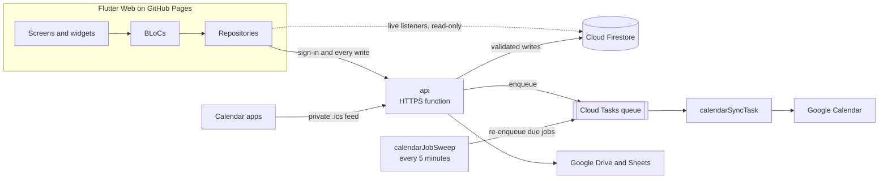

# Shavtzak (שבצק)

A web app for scheduling a team onto events: who fills which role, at which event, with everyone's availability taken into account. The interface is in Hebrew and laid out right-to-left.

[](https://github.com/omerbengal/Shavtzak/actions/workflows/web.yml)


## The Problem

The first version was a Google Sheet driven by Apps Script. An assignment was a cell, so it was identified by position: this row is a person, this column is an event. Inserting a row or reordering a column silently pointed assignments at the wrong person or the wrong event.

## The Solution

Every assignment is its own record holding an `eventId` and a `teamMemberId`. Repositories join the full event and member for display, so nothing is copied and nothing can drift out of sync when either side is edited.

## Features

- **Events with role quotas.** Each event states how many people it needs per role, and the event list is colour-coded by how filled it is: none, partial or complete.
- **Assignments with conflict warnings.** Members who are unavailable, or already booked the same day, are flagged. Edits are staged and committed as one batch.
- **Two availability models.** Permanent members are available by default and request time off, which an admin approves. Non-permanent members are unavailable by default and mark the dates they can work.
- **Live updates.** Every screen is fed by Firestore listeners, so a change made by one person appears for everyone without a refresh.
- **Calendar integration.** Events and constraints sync to Google Calendar through a rate-limited task queue, and each member gets a private `.ics` feed for any calendar app.
- **Export and share.** Export assignments to Google Sheets, or share one event's roster as an image.
- **Admin and member areas.** Sign-in is by personal passcode. Admins manage members, events, assignments and checklists; members see their own schedule and availability.
- **Built-in test environment.** `/test/*` routes run the same build against `test_`-prefixed collections, isolated from production data.

## Tech Stack

- **Frontend:** Flutter Web (Dart), `flutter_bloc`, `go_router`, `equatable`
- **Backend:** Cloud Functions for Firebase (TypeScript, Express, Node.js 22)
- **Database:** Cloud Firestore
- **Auth:** Firebase Auth custom tokens, issued after a passcode check
- **Integrations:** Google Calendar, Google Drive and Sheets, iCalendar feeds
- **Deployment:** GitHub Actions to GitHub Pages (web), Firebase CLI (functions and rules)

## Architecture



- **The client never writes to the database.** `firestore.rules` denies every client write. Reads are live listeners; each change goes through the `api` function, which validates it and writes with the Admin SDK.
- **Calendar work is queued.** A slow or quota-limited Google API cannot block a save, and a scheduled sweep picks up anything that was deferred.
- **The client follows Clean Architecture.** Domain entities have no framework dependencies, and all storage sits behind a `DatabaseInterface`, with Firestore as the one implementation.

## Getting Started

### Prerequisites

- [Flutter](https://docs.flutter.dev/get-started/install) 3.41.9 on the stable channel (the version CI builds with)
- Node.js 22 and npm, for the Cloud Functions only
- [Firebase CLI](https://firebase.google.com/docs/cli), for deploying only

### Run the web app

```bash
git clone https://github.com/omerbengal/Shavtzak.git
cd Shavtzak/shavtzak   # every Flutter command runs from here, not the repo root
flutter pub get
flutter run -d chrome
```

The checked-in `lib/firebase_options.dart` points at the team's own Firebase project, where sign-in needs a member passcode. To run against a project of your own:

1. Create a Firebase project with Firestore and Authentication enabled.
2. Run `flutterfire configure` from `shavtzak/` to regenerate `lib/firebase_options.dart`. The client derives the API host from that project ID.
3. Run `firebase deploy --only functions,firestore:rules` from the repo root.
4. Create the first admin member by hand in the Firestore console. There is no seed script.

The Calendar and Sheets features also need a Google OAuth client.

### Run the tests

```bash
# from the repo root
cd shavtzak && flutter test              # unit, BLoC and widget tests
cd ../functions && npm ci && npm test    # Cloud Functions tests
```

Neither suite needs a Firebase project. `flutter analyze` exits non-zero on a clean checkout because of existing lint infos and warnings (no errors), so judge a change by whether it adds new ones.

## Deployment

- **Web** deploys itself. Every push to `main` runs [`web.yml`](.github/workflows/web.yml), which builds the release bundle and publishes it to GitHub Pages. Pull requests run the same build without publishing.
- **Functions and rules** are deployed by hand with `firebase deploy --only functions,firestore:rules`. The one source bundle builds three functions (`api`, `calendarSyncTask`, `calendarJobSweep`), so confirm all three with `firebase functions:list`.

## Project Structure

```
.
├── shavtzak/                   # Flutter web app
│   ├── lib/
│   │   ├── core/               # Router, theme, constants, shared services
│   │   ├── domain/entities/    # Event, TeamMember, Assignment and friends
│   │   ├── data/               # DatabaseInterface, Firestore implementation, repositories
│   │   └── presentation/       # BLoCs, screens, widgets
│   └── test/                   # Mirrors lib/
├── functions/src/              # Cloud Functions and their tests (TypeScript)
├── firestore.rules             # Security rules: members read, nobody writes
├── .github/workflows/web.yml   # Build and deploy to GitHub Pages
├── docs/superpowers/           # Design specs and implementation plans, per feature
└── archive/                    # The V1 spreadsheet, its Apps Script, old notes
```

[`CLAUDE.md`](CLAUDE.md) covers the architecture and conventions in more depth.
